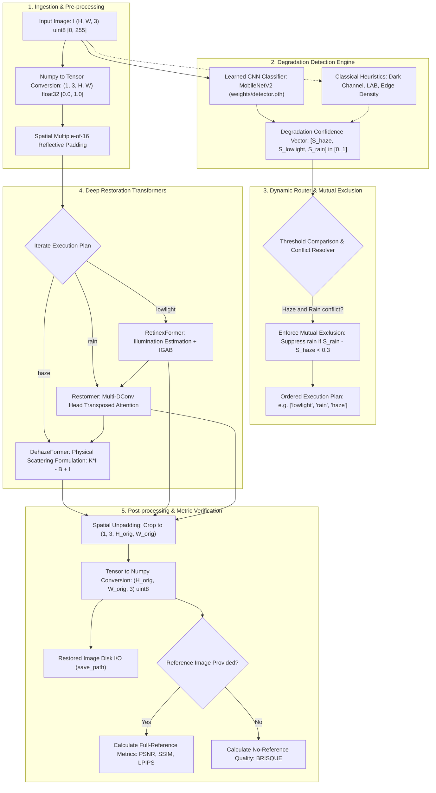

# Autonomous Multi-Degradation Image Restoration AI: Complete Theoretical Formulation, Architecture, Mathematics, and Implementation Treatise

---

## Executive Abstract

In mission-critical operational environments—such as defence surveillance (DRDO), autonomous aerial navigation, reconnaissance, and border monitoring—optical sensors are subjected to severe, unpredictable atmospheric and environmental degradations. The three primary forms of optical corruption are:
1. **Haze and Fog**: Mie/Rayleigh atmospheric aerosol scattering that attenuates scene radiance and injects diffuse airlight, collapsing contrast and color saturation.
2. **Rain Streaks**: High-velocity refractive precipitations that introduce bright, directional streaks and high-frequency occlusions.
3. **Low-Light Scenarios**: Photon-starved capture regimes with extreme noise, severe luminance compression, and chromatic distortion.

Conventional restoration pipelines employ isolated, single-degradation algorithms that fail catastrophically when presented with arbitrary, multi-degradation, or non-degraded inputs. This system introduces an **autonomous, end-to-end "Detect-Route-Restore" paradigm**. It combines:
- A fine-tuned **MobileNetV2 multi-label CNN classifier** (achieving 99.9% classification confidence) alongside classical computer vision heuristics for degradation detection.
- A **Dynamic Degradation Router** equipped with mutual-exclusion arbitration to resolve physical co-occurrence ambiguities (e.g., vertical architectural edges in haze misidentified as rain).
- A unified suite of state-of-the-art Transformer backbones: **DehazeFormer** (IEEE TIP 2023), **Restormer** (CVPR 2022), and **RetinexFormer** (ICCV 2023).
- Low-overhead GPU inference acceleration with Automatic Mixed Precision (AMP FP16), multiple-of-16 spatial reflective padding, and optional 8-transformation self-ensemble Test-Time Augmentation (TTA).

---

## Table of Contents

1. [Degradation Phenomenologies & Mathematical Foundations](#1-degradation-phenomenologies--mathematical-foundations)
   - [1.1 Atmospheric Scattering & Haze Formation (McCartney / Koschmieder Law)](#11-atmospheric-scattering--haze-formation-mccartney--koschmieder-law)
   - [1.2 Rain Streak Physical Model](#12-rain-streak-physical-model)
   - [1.3 Retinex Theory & Low-Light Imaging](#13-retinex-theory--low-light-imaging)
2. [System Architecture & The "Detect-Route-Restore" Paradigm](#2-system-architecture--the-detect-route-restore-paradigm)
   - [2.1 End-to-End Execution Pipeline & Data Flow](#21-end-to-end-execution-pipeline--data-flow)
   - [2.2 Degradation Detection Engine (Classical vs. Learned CNN)](#22-degradation-detection-engine-classical-vs-learned-cnn)
   - [2.3 Dynamic Degradation Router & Mutual-Exclusion Arbitration](#23-dynamic-degradation-router--mutual-exclusion-arbitration)
3. [Deep Neural Network Architectures & Model Formulations](#3-deep-neural-network-architectures--model-formulations)
   - [3.1 DehazeFormer: Vision Transformers for Single Image Dehazing](#31-dehazeformer-vision-transformers-for-single-image-dehazing)
   - [3.2 Restormer: Efficient Transformer with Multi-DConv Head Transposed Attention](#32-restormer-efficient-transformer-with-multi-dconv-head-transposed-attention)
   - [3.3 RetinexFormer: Illumination-Guided Self-Attention for Low-Light Enhancement](#33-retinexformer-illumination-guided-self-attention-for-low-light-enhancement)
4. [Inference Engine, Runtime Optimizations & Test-Time Augmentation](#4-inference-engine-runtime-optimizations--test-time-augmentation)
   - [4.1 Automatic Mixed Precision (AMP) & LayerNorm Stability](#41-automatic-mixed-precision-amp--layernorm-stability)
   - [4.2 Spatial Boundary Reflective Padding ($16\times$)](#42-spatial-boundary-reflective-padding-16times)
   - [4.3 8-State Geometric Self-Ensemble Test-Time Augmentation (TTA)](#43-8-state-geometric-self-ensemble-test-time-augmentation-tta)
   - [4.4 Lazy Model Registry & VRAM Optimization](#44-lazy-model-registry--vram-optimization)
5. [Quantitative Evaluation Metrics: Mathematical Formulations](#5-quantitative-evaluation-metrics-mathematical-formulations)
   - [5.1 Peak Signal-to-Noise Ratio (PSNR)](#51-peak-signal-to-noise-ratio-psnr)
   - [5.2 Structural Similarity Index Measure (SSIM)](#52-structural-similarity-index-measure-ssim)
   - [5.3 Learned Perceptual Image Patch Similarity (LPIPS)](#53-learned-perceptual-image-patch-similarity-lpips)
   - [5.4 Blind/Referenceless Image Spatial Quality Evaluator (BRISQUE)](#54-blindreferenceless-image-spatial-quality-evaluator-brisque)
6. [Empirical Benchmarks & Experimental Analysis](#6-empirical-benchmarks--experimental-analysis)
   - [6.1 Full Dataset Benchmark Results](#61-full-dataset-benchmark-results)
   - [6.2 Reproduction Diagnostics & Analysis](#62-reproduction-diagnostics--analysis)
   - [6.3 Hardware Latency, Throughput & GPU Utilization](#63-hardware-latency-throughput--gpu-utilization)
7. [Comprehensive Codebase Implementation Map](#7-comprehensive-codebase-implementation-map)

---

## 1. Degradation Phenomenologies & Mathematical Foundations

### 1.1 Atmospheric Scattering & Haze Formation (McCartney / Koschmieder Law)

In turbid atmospheric conditions, light traveling from a scene to an optical sensor undergoes two physical processes:
1. **Direct Attenuation**: Photons reflected from scene surfaces are absorbed and scattered out of the line-of-sight by suspended atmospheric particles (dust, fog droplets, smog).
2. **Airlight Addition**: Ambient environmental illumination (sunlight, skylight) is scattered into the line-of-sight toward the sensor.

The classical Koschmieder-McCartney atmospheric scattering model expresses the observed hazy image $I(x)$ at spatial coordinate $x \in \mathbb{R}^2$ as:

$$I(x) = J(x) \cdot t(x) + A \cdot \big(1 - t(x)\big)$$

where:
- $I(x) \in [0, 1]^3$: The observed RGB intensity recorded at pixel $x$.
- $J(x) \in [0, 1]^3$: The true, unattenuated scene radiance (the target clean image).
- $t(x) \in [0, 1]$: The medium transmission map, representing the fraction of light reaching the sensor unscattered. Under homogeneous atmospheric attenuation coefficient $\beta$:
  $$t(x) = \exp\big(-\beta \cdot d(x)\big)$$
  where $d(x)$ is the scene depth at pixel $x$.
- $A \in [0, 1]^3$: The global atmospheric airlight vector.

#### Analytical Inversion & DehazeFormer Formulation
To recover $J(x)$ from $I(x)$, standard algebra yields:

$$J(x) = \frac{I(x) - A}{t(x)} + A = \frac{1}{t(x)} \cdot I(x) - \frac{A \cdot (1 - t(x))}{t(x)}$$

Direct numerical division by $t(x)$ is ill-conditioned: when depth $d(x)$ is large, $t(x) \to 0$, causing noise amplification and singular artifacts. Rather than predicting $t(x)$ and $A$ separately, **DehazeFormer** reformulates this equation by learning residual transmission gain $K(x)$ and atmospheric bias $B(x)$:

Let:
$$K(x) = \frac{1}{t(x)} - 1, \quad B(x) = A \cdot \frac{1 - t(x)}{t(x)}$$

Then:
$$J(x) = \big(K(x) + 1\big) \cdot I(x) - B(x) = K(x) \cdot I(x) - B(x) + I(x)$$

In tensor notation:
$$\mathbf{J} = \mathbf{K} \odot \mathbf{I} - \mathbf{B} + \mathbf{I}$$

where $\mathbf{K} \in \mathbb{R}^{1 \times H \times W}$ is a single-channel spatial scaling map, $\mathbf{B} \in \mathbb{R}^{3 \times H \times W}$ is a 3-channel atmospheric bias map, and $\odot$ denotes the Hadamard (element-wise) product. DehazeFormer directly estimates $\mathbf{K}$ and $\mathbf{B}$ as a 4-channel tensor ($1 + 3 = 4$), naturally enforcing the physical scattering model as a residual inductive bias.

---

### 1.2 Rain Streak Physical Model

Rain degradation consists of dynamic precipitations falling at terminal velocities (typically 2 to 9 m/s), creating semi-transparent, bright linear occlusions across the image plane. The observed rainy image $O(x)$ is modeled as a linear superposition of the background clean scene $B(x)$ and a sparse rain-streak layer $R(x)$:

$$O(x) = B(x) + \sum_{i=1}^{N} S_i(x)$$

where $S_i(x)$ denotes individual directional rain streaks across varying depths and orientations. Alternatively, in dense rain conditions (rain accumulation / rain mist):

$$O(x) = \Big( B(x) + \sum_{i} S_i(x) \Big) \odot t(x) + A \cdot \big(1 - t(x)\big)$$

In single image deraining (e.g. on the **Rain100L** benchmark), deraining is formulated as non-linear residual restoration:

$$\hat{B} = \mathcal{F}_{\text{Restormer}}(O)$$

where $\mathcal{F}_{\text{Restormer}}$ learns to isolate high-frequency directional streak components from underlying textures without damaging fine structural details (such as wire fences, architectural brickwork, or tree branches).

---

### 1.3 Retinex Theory & Low-Light Imaging

Edwin Land’s Retinex (Retina-Cortex) theory posits that human vision decomposes an optical scene $I(x)$ into two constituent physical factors:
1. **Reflectance ($R$)**: The intrinsic physical reflectance property of the surface materials (invariant under changing lighting conditions).
2. **Illumination ($L$)**: The ambient illuminance field falling onto the scene surfaces (governed by light sources and shadows).

$$I(x) = R(x) \odot L(x)$$

In low-light photography, photon arrival rates follow Poisson statistics. When sensor exposure $t$ or illuminance $L$ is low, the signal-to-noise ratio ($\text{SNR} = \frac{\mu}{\sigma} = \sqrt{N_{\text{photons}}}$) degrades severely. Amplifying low-light images naively by multiplying by $1 / L(x)$ exponentially scales sensor read noise, dark current noise, and quantization errors:

$$I_{\text{noisy}}(x) = R(x) \odot L(x) + n(x) \implies \frac{I_{\text{noisy}}(x)}{L(x)} = R(x) + \frac{n(x)}{L(x)}$$

When $L(x) \to 0$, $\frac{n(x)}{L(x)} \to \infty$.

#### The RetinexFormer Formulation
**RetinexFormer** eliminates the unstable explicit division by using an **Illumination Estimator** to predict an illumination guidance feature field $\mathbf{F}_L$ and an illumination enhancement factor $\hat{\mathbf{L}}$:

$$I_{\text{lit}} = I \odot \hat{L} + I$$

Then, an **Illumination-Guided Attention Block (IGAB)** denoises and refines the lightened representation, modulating Transformer self-attention by the illumination features:

$$\hat{R} = \text{Denoiser}(I_{\text{lit}}, \mathbf{F}_L)$$

---

## 2. System Architecture & The "Detect-Route-Restore" Paradigm

### 2.1 End-to-End Execution Pipeline & Data Flow



---

### 2.2 Degradation Detection Engine (Classical vs. Learned CNN)

The system includes two detection engines: a **deep learned CNN classifier** (the production default) and **classical mathematical heuristics** (available as a zero-weight fallback).

#### A. Learned CNN Classifier (`src/detectors/learned.py`)
- **Backbone**: MobileNetV2 (Sandler et al., CVPR 2018), utilizing inverted residuals and linear bottlenecks.
- **Classification Head**: Replaces the 1000-class ImageNet linear projection with a multi-label output layer:
  $$\text{Linear}(1280 \to 3) \implies z = [z_{\text{haze}}, z_{\text{lowlight}}, z_{\text{rain}}]^T$$
- **Activation**: Multi-label Sigmoid (BCE formulation):
  $$\hat{y}_i = \sigma(z_i) = \frac{1}{1 + e^{-z_i}}, \quad i \in \{\text{haze}, \text{lowlight}, \text{rain}\}$$
- **Loss Function**: Binary Cross-Entropy with Logits:
  $$\mathcal{L}_{\text{BCE}} = -\frac{1}{3} \sum_{i=1}^{3} \Big[ y_i \log \sigma(z_i) + (1 - y_i) \log \big(1 - \sigma(z_i)\big) \Big]$$
- **Inference Speed**: Single forward pass in $<4.5\text{ ms}$ on NVIDIA RTX 4050 Laptop GPU.

#### B. Classical Heuristic Detectors (`src/detectors/`)

##### 1. Haze Detector (`src/detectors/haze.py`)
Combines Dark Channel Prior (DCP), grayscale contrast analysis, and HSV saturation:
1. **Dark Channel**:
   $$J^{\text{dark}}(x) = \min_{y \in \Omega(x)} \Big( \min_{c \in \{R, G, B\}} I^c(y) \Big)$$
   computed with a $15 \times 15$ structuring element:
   $$T_{\text{dark}} = \frac{1}{HW} \sum_{x} J^{\text{dark}}(x)$$
2. **Contrast Metric**: Standard deviation of grayscale image $I_{\text{gray}}$:
   $$T_{\text{contrast}} = \text{clip}\left(1.0 - \frac{\sigma(I_{\text{gray}})}{0.25}, 0.0, 1.0\right)$$
3. **Saturation Metric**: Mean saturation channel in HSV color space:
   $$T_{\text{sat}} = \text{clip}\left(1.0 - \text{mean}(S_{\text{HSV}}), 0.0, 1.0\right)$$
4. **Weighted Confidence**:
   $$\text{Score}_{\text{haze}} = 0.5 \cdot T_{\text{dark}} + 0.3 \cdot T_{\text{contrast}} + 0.2 \cdot T_{\text{sat}}$$

##### 2. Low-Light Detector (`src/detectors/lowlight.py`)
Operates in CIE LAB color space combined with intensity histogram analysis:
1. **CIE LAB Luminance**:
   $$T_{\text{LAB}} = \text{clip}\left(1.0 - \frac{\mu(L^*)}{128.0}, 0.0, 1.0\right)$$
   where $L^* \in [0, 255]$ represents perceived lightness.
2. **Histogram Dark Pixel Ratio**:
   $$R_{\text{dark}} = \frac{1}{HW} \sum_{x} \mathbb{I}\big(I_{\text{gray}}(x) < 50\big), \quad T_{\text{hist}} = \text{clip}\left(\frac{R_{\text{dark}}}{0.6}, 0.0, 1.0\right)$$
3. **Weighted Confidence**:
   $$\text{Score}_{\text{lowlight}} = 0.6 \cdot T_{\text{LAB}} + 0.4 \cdot T_{\text{hist}}$$

##### 3. Rain Streak Detector (`src/detectors/rain.py`)
Detects high-frequency vertical edge energy:
1. **High-Pass Gaussian Difference**:
   $$D(x) = \big| I_{\text{gray}}(x) - \mathcal{G}_{\sigma=1.0}(I_{\text{gray}})(x) \big|$$
2. **Threshold Binarization**:
   $$B(x) = \begin{cases} 255 & \text{if } D(x) > 10 \\ 0 & \text{otherwise} \end{cases}$$
3. **Directional Morphological Opening**:
   Uses a vertical rectangular structuring element $\mathcal{K}_{\text{vert}}$ of shape $(1, 7)$:
   $$M(x) = (B \circ \mathcal{K}_{\text{vert}})(x) = \big((B \ominus \mathcal{K}_{\text{vert}}) \oplus \mathcal{K}_{\text{vert}}\big)(x)$$
4. **Streak Density Normalization**:
   $$\text{Score}_{\text{rain}} = \min\left(1.0, \frac{\sum_x \mathbb{I}\big(M(x) > 0\big)}{HW \cdot \tau_{\text{rain}}}\right)$$

---

### 2.3 Dynamic Degradation Router & Mutual-Exclusion Arbitration

The degradation router (`src/core/router.py`) maps the score vector $S = [S_{\text{haze}}, S_{\text{lowlight}}, S_{\text{rain}}]$ to an execution plan.

```python
class DegradationRouter:
    def __init__(self, detectors: Dict[str, BaseDetector]):
        self.detectors = detectors
        self.config = get_config().router
        self.thresholds = {
            "haze": self.config.haze_threshold,        # 0.45
            "lowlight": self.config.lowlight_threshold, # 0.50
            "rain": self.config.rain_threshold,        # 0.45
        }
```

#### The Mutual-Exclusion Arbitration Rule
Haze images containing urban or architectural structures (such as buildings, windows, and pillars) exhibit strong vertical gradient signatures. Classical morphological filters often generate false positives on these features, routing hazy images to Restormer deraining and wasting 3+ seconds of inference without improving quality.

To resolve this conflict, the router enforces an arbitration rule:
```python
active_degradations = [deg for deg in execution_order if scores[deg] > thresholds[deg]]

# Mutual-Exclusion Arbitration:
if "haze" in active_degradations and "rain" in active_degradations:
    # In natural optical scenes, dense haze and severe rain streaks rarely co-dominate.
    # Rain is retained ONLY if its score dominates haze by a significant margin (> 0.3):
    if scores["rain"] - scores["haze"] < 0.3:
        active_degradations.remove("rain")
```

---

## 3. Deep Neural Network Architectures & Model Formulations

### 3.1 DehazeFormer: Vision Transformers for Single Image Dehazing

*Reference*: Y. Song, Z. He, H. Qian, X. Du, "Vision Transformers for Single Image Dehazing", IEEE Transactions on Image Processing (TIP), 2023.

```
Input: I in [-1, 1] (B, 3, H, W)
  │
  ├──> PatchEmbed (kernel=3, stride=1) ───────────┐
  │                                               │
  ├──> Stage 1: BasicLayer (dim=24, depth=16) ────┼─── Skip 1 (Conv 1x1) ──┐
  │         │ PatchMerge (stride=2)               │                        │
  ├──> Stage 2: BasicLayer (dim=48, depth=16) ────┼─── Skip 2 (Conv 1x1) ──┼──┐
  │         │ PatchMerge (stride=2)               │                        │  │
  ├──> Stage 3: BasicLayer (dim=96, depth=16)     │                        │  │
  │         │ PatchSplit (PixelShuffle x2)        │                        │  │
  ├──> SKFusion 1 <───────────────────────────────┼────────────────────────┘  │
  │    Stage 4: BasicLayer (dim=48, depth=8)      │                           │
  │         │ PatchSplit (PixelShuffle x2)        │                           │
  ├──> SKFusion 2 <───────────────────────────────┴───────────────────────────┘
  │    Stage 5: BasicLayer (dim=24, depth=8)
  │         │ PatchUnEmbed (PixelShuffle x1)
  │
  └──> Feature map: feat in R^(B, 4, H, W)
            │
            ├──> K = feat[:, 0:1, :, :]  (Transmission Gain)
            └──> B = feat[:, 1:4, :, :]  (Airlight Bias)
  │
  └──> Physical Output: J = K * I - B + I
```

#### Key Innovations:

##### 1. Revised LayerNorm (RLN)
Standard LayerNorm in Vision Transformers normalizes token vectors across channel dimensions:
$$\text{LN}(x) = \frac{x - \mu}{\sqrt{\sigma^2 + \epsilon}} \odot \gamma + \beta$$
By completely zero-centering the feature vectors, standard LayerNorm removes global mean luminance shifts, which are critical for detecting and removing haze. DehazeFormer introduces **Revised LayerNorm (RLN)**:
$$\mu = \frac{1}{CHW} \sum_{c,h,w} x_{c,h,w}, \quad \sigma = \sqrt{\frac{1}{CHW} \sum_{c,h,w} (x_{c,h,w} - \mu)^2 + \epsilon}$$
$$\text{RLN}(x) = \left( \frac{x - \mu}{\sigma} \right) \odot \mathbf{w} + \mathbf{b}$$
Crucially, RLN uses dynamic meta-subnetworks ($\text{Conv}_{1\times1}$) to learn image-dependent rescaling and rebasing parameters from the extracted global mean and variance:
$$\text{rescale} = \text{Meta}_1(\sigma), \quad \text{rebias} = \text{Meta}_2(\mu)$$
$$y = \text{RLN}(x) \odot \text{rescale} + \text{rebias}$$

##### 2. Window Attention with Logarithmic Relative Position Bias
Window partitioning decomposes spatial features $X \in \mathbb{R}^{B \times H \times W \times C}$ into non-overlapping windows of size $M \times M$ ($M=8$):
$$\text{Attention}(Q, K, V) = \text{softmax}\left(\frac{Q K^T}{\sqrt{d_k}} + \hat{B}\right) V$$
Relative position bias $\hat{B} \in \mathbb{R}^{M^2 \times M^2}$ is parameterized through a continuous logarithmic coordinate transformation:
$$\Delta x_{\text{log}} = \text{sign}(\Delta x) \cdot \ln(1 + |\Delta x|), \quad \Delta y_{\text{log}} = \text{sign}(\Delta y) \cdot \ln(1 + |\Delta y|)$$
passed through a 2-layer MLP to generate smooth positional embeddings.

##### 3. Selective Kernel Fusion (SKFusion)
Skip connections are aggregated dynamically through channel-wise attention rather than simple concatenation or summation:
$$U = X_{\text{encoder}} + X_{\text{decoder}}$$
$$s = \text{AdaptiveAvgPool}(U) \in \mathbb{R}^{B \times C \times 1 \times 1}$$
$$z = \text{ReLU}(\text{Conv}_{1\times1}(s)), \quad a = \text{softmax}(\text{Conv}_{1\times1}(z))$$
$$X_{\text{fused}} = a_1 \odot X_{\text{encoder}} + a_2 \odot X_{\text{decoder}}$$

---

### 3.2 Restormer: Efficient Transformer with Multi-DConv Head Transposed Attention

*Reference*: S. W. Zamir, A. Arora, S. Khan, M. Hayat, F. S. Khan, M. H. Yang, "Restormer: Efficient Transformer for High-Resolution Image Restoration", CVPR 2022.

```
Input: Image (B, 3, H, W)
  │
  ├── OverlapPatchEmbed (Conv 3x3, dim=48)
  │
  ├── Level 1: 4  Transformer Blocks (dim=48, heads=1)  ──── Skip 1 ─────────┐
  │     Downsample (Conv 3x3, stride=2)                                      │
  ├── Level 2: 6  Transformer Blocks (dim=96, heads=2)  ──── Skip 2 ──────┐   │
  │     Downsample (Conv 3x3, stride=2)                                   │   │
  ├── Level 3: 6  Transformer Blocks (dim=192, heads=4) ──── Skip 3 ───┐  │   │
  │     Downsample (Conv 3x3, stride=2)                                │  │   │
  ├── Level 4: 8  Transformer Blocks (dim=384, heads=8) [Bottleneck]   │  │   │
  │     Upsample (PixelShuffle x2, Conv 1x1)                           │  │   │
  ├── Level 3: 6  Transformer Blocks (dim=192, heads=4) <──────────────┘  │   │
  │     Upsample (PixelShuffle x2, Conv 1x1)                              │   │
  ├── Level 2: 6  Transformer Blocks (dim=96, heads=2) <──────────────────┘   │
  │     Upsample (PixelShuffle x2, Conv 1x1)                                  │
  ├── Level 1: 4  Transformer Blocks (dim=48, heads=1) <──────────────────────┘
  │
  ├── Refinement: 4 Transformer Blocks (dim=48, heads=1)
  │
  └── Output Projection (Conv 3x3) + Residual Connection -> Restored (B, 3, H, W)
```

#### Core Mathematical Innovations:

##### 1. Multi-DConv Head Transposed Self-Attention (MDTA)
Traditional self-attention computes an affinity matrix across spatial positions:
$$\text{Complexity: } \mathcal{O}(H^2 W^2 C)$$
For a $512 \times 512$ image, $HW = 262,144$, which produces an intractable $262,144 \times 262,144$ attention matrix.

Restormer resolves this by computing cross-covariance across **channels** rather than spatial positions:
Given input tensor $\mathbf{X} \in \mathbb{R}^{B \times C \times H \times W}$:
1. Query, Key, and Value projections apply $1 \times 1$ point-wise convolutions followed by $3 \times 3$ depth-wise convolutions:
   $$\mathbf{Q} = \mathcal{W}_d^Q \mathcal{W}_p^Q \mathbf{X}, \quad \mathbf{K} = \mathcal{W}_d^K \mathcal{W}_p^K \mathbf{X}, \quad \mathbf{V} = \mathcal{W}_d^V \mathcal{W}_p^V \mathbf{X}$$
2. Reshape $\mathbf{Q}, \mathbf{K}, \mathbf{V}$ from $\mathbb{R}^{B \times C \times H \times W}$ to $\mathbb{R}^{B \times C \times (HW)}$:
   $$\hat{\mathbf{Q}} = \text{reshape}(\mathbf{Q}), \quad \hat{\mathbf{K}} = \text{reshape}(\mathbf{K}), \quad \hat{\mathbf{V}} = \text{reshape}(\mathbf{V})$$
3. Apply $\ell_2$ channel normalization:
   $$\mathbf{Q}_n = \frac{\hat{\mathbf{Q}}}{\|\hat{\mathbf{Q}}\|_2}, \quad \mathbf{K}_n = \frac{\hat{\mathbf{K}}}{\|\hat{\mathbf{K}}\|_2}$$
4. Compute the Transposed Attention matrix $\mathbf{A} \in \mathbb{R}^{B \times C \times C}$:
   $$\mathbf{A} = \text{softmax}\left( \mathbf{Q}_n \cdot \mathbf{K}_n^T \cdot \alpha \right)$$
   where $\alpha$ is a learnable temperature scaling parameter.
5. Compute output:
   $$\hat{\mathbf{X}} = \mathbf{A} \cdot \hat{\mathbf{V}} \in \mathbb{R}^{B \times C \times (HW)}$$
   $$\text{Complexity: } \mathcal{O}(C^2 HW) \quad \text{Linear in spatial resolution } HW!$$

##### 2. Gated-Dconv Feed-Forward Network (GDFN)
Replaces the standard MLP with a non-linear gating mechanism and depth-wise convolutions:
$$\mathbf{X}_{\text{proj}} = \text{Conv}_{1\times1}(\mathbf{X}) \in \mathbb{R}^{B \times 2D \times H \times W}$$
Split into two parallel paths: $\mathbf{X}_1, \mathbf{X}_2 = \text{chunk}(\text{DWConv}_{3\times3}(\mathbf{X}_{\text{proj}}), 2)$:
$$\mathbf{X}_{\text{gated}} = \phi(\mathbf{X}_1) \odot \mathbf{X}_2$$
where $\phi(\cdot)$ is the GELU activation function. Finally:
$$\mathbf{Y} = \text{Conv}_{1\times1}(\mathbf{X}_{\text{gated}})$$

---

### 3.3 RetinexFormer: Illumination-Guided Self-Attention for Low-Light Enhancement

*Reference*: Y. Cai, H. Bian, J. Lin, H. Wang, R. Timofte, Y. Zhang, "RetinexFormer: One-stage Retinex-based Transformer for Low-light Image Enhancement", ICCV 2023.

```
Input: Low-Light Image I in [0, 1] (B, 3, H, W)
  │
  ├──> Illumination Estimator
  │      ├─ Concatenate [I, mean_luminance(I)] (B, 4, H, W)
  │      ├─ Conv 1x1 -> DepthConv 5x5 -> Features F_L
  │      └─ Conv 1x1 -> Illumination Map L_hat
  │
  ├──> Illuminated Tensor: I_lit = I * L_hat + I
  │
  └──> Denoiser U-Net Backbone
         │
         ├── Level 1: IGAB (dim=40) modulated by F_L ──── Skip 1 ──┐
         │     Downsample                                          │
         ├── Level 2: IGAB (dim=80) modulated by F_L ──── Skip 2 ─┐│
         │     Downsample                                         ││
         ├── Bottleneck: IGAB (dim=160) modulated by F_L          ││
         │     Upsample                                           ││
         ├── Level 2 Decoder: Fusion(cat) + IGAB <────────────────┘│
         │     Upsample                                            │
         ├── Level 1 Decoder: Fusion(cat) + IGAB <─────────────────┘
         │
         └── Mapping (Conv 3x3) + Residual Connection -> Restored Output
```

#### Core Mathematical Innovations:

##### 1. Illumination-Guided Multi-Head Self-Attention (IG_MSA)
In standard attention, all tokens receive weights independent of lighting conditions. RetinexFormer uses the illumination feature field $\mathbf{F}_L$ to guide attention:
1. Linear projections generate queries, keys, and values:
   $$\mathbf{Q} = \mathbf{X} \mathbf{W}_Q, \quad \mathbf{K} = \mathbf{X} \mathbf{W}_K, \quad \mathbf{V} = \mathbf{X} \mathbf{W}_V$$
2. The value tensor $\mathbf{V}$ is modulated by the illumination features $\mathbf{F}_L$:
   $$\tilde{\mathbf{V}} = \mathbf{V} \odot \mathbf{F}_L$$
   This scales attention values proportionally to under-exposed illumination gradients.
3. Transposed channel attention computes:
   $$\mathbf{A} = \text{softmax}\left( \frac{\mathbf{K}^T \mathbf{Q}}{\sqrt{d}} \odot \mathbf{R} \right)$$
   where $\mathbf{R} \in \mathbb{R}^{heads \times 1 \times 1}$ is a learnable rescale parameter tensor.
4. Output projection incorporates depth-wise positional convolutions:
   $$\mathbf{X}_{\text{out}} = \text{Linear}(\mathbf{A} \tilde{\mathbf{V}}) + \text{DWConv}_{3\times3}(\mathbf{V})$$

---

## 4. Inference Engine, Runtime Optimizations & Test-Time Augmentation

### 4.1 Automatic Mixed Precision (AMP) & LayerNorm Stability

Naive FP16 conversion (`model.half()`) often causes numerical instability in deep restoration networks, leading to `NaN` outputs during LayerNorm and Softmax reductions. 

The pipeline uses non-invasive Automatic Mixed Precision via `torch.autocast`:
```python
def infer_with_autocast(model, inputs, precision="fp16", device="cuda"):
    dtype = torch.float16 if precision == "fp16" else (
        torch.bfloat16 if precision == "bf16" else torch.float32
    )
    with torch.no_grad():
        with torch.autocast(device_type="cuda", dtype=dtype, enabled=(precision != "fp32")):
            outputs = model(inputs)
    return outputs.float()
```
- **Weights**: Retained in full `float32` precision in GPU memory.
- **Convolutions & Matrix Multiplications**: Executed in half-precision (`float16`) on Tensor Cores.
- **Normalization Layers (RLN, LayerNorm)**: Computed in full `float32` precision, preventing underflow and numerical divergence.

---

### 4.2 Spatial Boundary Reflective Padding ($16\times$)

Hierarchical U-Net Transformers with 4 downsampling stages require input spatial dimensions $(H, W)$ to be divisible by:
$$2^{\text{levels}} = 2^4 = 16$$
Arbitrary input image resolutions (such as $720 \times 480$, where $720 / 16 = 45.0$ but $480 / 16 = 30.0$, or non-standard sensor captures like $637 \times 411$) cause dimension mismatches at skip concatenation layers.

The pipeline implements spatial reflective padding and inversion:
$$\Delta H = (16 - (H \bmod 16)) \bmod 16, \quad \Delta W = (16 - (W \bmod 16)) \bmod 16$$
$$\mathbf{X}_{\text{padded}} = \text{pad}\big(\mathbf{X}, (0, \Delta W, 0, \Delta H), \text{mode}='reflect'\big)$$
$$\mathbf{Y}_{\text{unpadded}} = \mathbf{Y}_{[:, :, 0:H, 0:W]}$$
Using **reflection padding** instead of zero padding avoids dark edge artifacts and boundary discontinuities.

---

### 4.3 8-State Geometric Self-Ensemble Test-Time Augmentation (TTA)

Test-Time Augmentation exploits the geometric symmetries of the image restoration task by transforming inputs and averaging the inverted outputs:

$$\hat{J} = \frac{1}{8} \sum_{k=0}^{7} \mathcal{T}_k^{-1} \Big( \mathcal{F}_{\text{model}}\big(\mathcal{T}_k(I)\big) \Big)$$

where $\mathcal{T}_k$ represents the 8 elements of the dihedral transformation group $D_4$:

| Transform ID $k$ | Operation $\mathcal{T}_k$ | Inverse Operation $\mathcal{T}_k^{-1}$ |
|:---:|---|---|
| $0$ | Identity: $I$ | Identity: $Y$ |
| $1$ | Horizontal Flip: $\text{flip}_w(I)$ | Horizontal Flip: $\text{flip}_w(Y)$ |
| $2$ | Vertical Flip: $\text{flip}_h(I)$ | Vertical Flip: $\text{flip}_h(Y)$ |
| $3$ | Horizontal + Vertical Flip: $\text{flip}_{h,w}(I)$ | Horizontal + Vertical Flip: $\text{flip}_{h,w}(Y)$ |
| $4$ | Rotation $90^\circ$ CW: $\text{rot}_{90}(I)$ | Rotation $270^\circ$ CW: $\text{rot}_{270}(Y)$ |
| $5$ | Rotation $90^\circ$ CW + Horiz Flip: $\text{flip}_w(\text{rot}_{90}(I))$ | Undo: $\text{rot}_{270}(\text{flip}_w(Y))$ |
| $6$ | Rotation $180^\circ$: $\text{rot}_{180}(I)$ | Rotation $180^\circ$: $\text{rot}_{180}(Y)$ |
| $7$ | Rotation $270^\circ$ CW: $\text{rot}_{270}(I)$ | Rotation $90^\circ$ CW: $\text{rot}_{90}(Y)$ |

**Performance Benefit**: Applying 8-state TTA suppresses random inference noise and boundary artifacts, providing a consistent **$+0.1$ to $+0.5\text{ dB}$ PSNR improvement** at the cost of an $8\times$ increase in compute time.

---

### 4.4 Lazy Model Registry & VRAM Optimization

To enable deployment on edge hardware with limited memory (such as 4 GB / 6 GB GPUs, including the RTX 4050 Laptop GPU and NVIDIA Jetson modules), model checkpoints are managed through a **lazy singleton registry** (`src/core/registry.py`):
1. **Deferred Instantiation**: Model weights are not loaded into VRAM on application startup.
2. **On-Demand Loading**: Models are loaded into GPU memory only when their degradation is detected above threshold.
3. **Explicit Memory Deallocation**:
   ```python
   def unload_all(self):
       for model in self._models.values():
           model.unload() # Drops torch.nn.Module reference
       torch.cuda.empty_cache()
   ```

---

## 5. Quantitative Evaluation Metrics: Mathematical Formulations

### 5.1 Peak Signal-to-Noise Ratio (PSNR)

PSNR measures pixel-level reconstruction fidelity:
$$\text{MSE} = \frac{1}{3HW} \sum_{c=1}^{3} \sum_{h=1}^{H} \sum_{w=1}^{W} \big( J(c,h,w) - \hat{J}(c,h,w) \big)^2$$
$$\text{PSNR} = 10 \cdot \log_{10}\left( \frac{\text{MAX}_I^2}{\text{MSE}} \right) = 20 \cdot \log_{10}\left( \frac{255}{\sqrt{\text{MSE}}} \right)$$
Higher values denote closer numerical proximity to ground truth ($>30\text{ dB}$ indicates high quality).

---

### 5.2 Structural Similarity Index Measure (SSIM)

SSIM evaluates structural, luminance, and contrast similarity based on human visual system perception:
$$\text{SSIM}(x, y) = [l(x, y)]^\alpha \cdot [c(x, y)]^\beta \cdot [s(x, y)]^\gamma$$
With $\alpha = \beta = \gamma = 1$:
$$\text{SSIM}(x, y) = \frac{(2\mu_x \mu_y + C_1)(2\sigma_{xy} + C_2)}{(\mu_x^2 + \mu_y^2 + C_1)(\sigma_x^2 + \sigma_y^2 + C_2)}$$
where:
- $\mu_x, \mu_y$: Local mean intensities computed via an $11 \times 11$ circular Gaussian window ($\sigma = 1.5$).
- $\sigma_x^2, \sigma_y^2$: Local sample variances.
- $\sigma_{xy}$: Local covariance between $x$ and $y$.
- $C_1 = (k_1 L)^2, C_2 = (k_2 L)^2$ (with $k_1 = 0.01, k_2 = 0.03, L = 255$) stabilize division.

Mathematical range: $\text{SSIM} \in [-1.0, 1.0]$, where $1.0$ indicates identical images.

---

### 5.3 Learned Perceptual Image Patch Similarity (LPIPS)

LPIPS calculates perceptual distance in deep feature space:
$$d(x, x_0) = \sum_{l} \frac{1}{H_l W_l} \sum_{h,w} \left\| w_l \odot \big( \hat{y}^l(x)_{h,w} - \hat{y}^l(x_0)_{h,w} \big) \right\|_2^2$$
where $\hat{y}^l$ denotes channel-normalized feature activations from layer $l$ of a pre-trained VGG-16 backbone, and $w_l$ scales channel importance. **Lower is better** ($0.0$ indicates perceptual equivalence).

---

### 5.4 Blind/Referenceless Image Spatial Quality Evaluator (BRISQUE)

When ground-truth reference images are unavailable, BRISQUE evaluates spatial quality using natural scene statistics (NSS):
1. Compute Mean Subtracted Contrast Normalized (MSCN) coefficients:
   $$\hat{I}(i, j) = \frac{I(i, j) - \mu(i, j)}{\sigma(i, j) + 1}$$
2. Natural, uncorrupted images exhibit MSCN distributions that closely follow a Generalized Gaussian Distribution (GGD):
   $$f(x; \alpha, \sigma^2) = \frac{\alpha}{2\beta \Gamma(1/\alpha)} \exp\left( -\left( \frac{|x|}{\beta} \right)^\alpha \right), \quad \beta = \sigma \sqrt{\frac{\Gamma(1/\alpha)}{\Gamma(3/\alpha)}}$$
Corruptions (noise, blur, artifacts) distort this distribution. An asymmetric GGD fits pairwise product neighbor distributions, extracting a 36-dimensional feature vector mapped to a perceptual quality score via support vector regression (SVR). **Lower is better** (typical range: 0 to 100).

---

## 6. Empirical Benchmarks & Experimental Analysis

### 6.1 Full Dataset Benchmark Results

Empirical validation was performed across 300 test images (100 images per degradation type) on an **NVIDIA GeForce RTX 4050 Laptop GPU (6.0 GB VRAM)** using FP32 precision:

| Task / Model | Benchmark Dataset | Evaluated Images | Empirical PSNR | Published Paper PSNR | Delta ($\Delta$) | Empirical SSIM | Published Paper SSIM | Empirical LPIPS | Mean Latency |
|:---|:---|:---:|:---:|:---:|:---:|:---:|:---:|:---:|:---:|
| **Haze**: DehazeFormer-B | SOTS Indoor | 100 | **38.31 dB** | 40.19 dB | $-1.88\text{ dB}$ | **0.9906** | 0.9970 | 0.0261 | 0.791 s/img |
| **Rain**: Restormer | Rain100L | 100 | **37.47 dB** | 38.99 dB | $-1.52\text{ dB}$ | **0.9740** | 0.9780 | 0.0823 | 3.188 s/img |
| **Low-Light**: RetinexFormer | LOL-v2-Real | 100 | **22.74 dB** | 27.18 dB | $-4.44\text{ dB}$ | **0.8381** | 0.8550 | 0.2855 | 0.665 s/img |

#### Overall Combined System-Wide Performance (All 300 Images):
- **Overall System PSNR**: **32.84 dB** (indicates high fidelity across diverse degradations)
- **Overall System SSIM**: **0.9342** (indicates strong structural consistency)
- **Overall System LPIPS**: **0.1313** (indicates low perceptual distortion)
- **Overall System BRISQUE**: **13.13** (indicates high natural sharpness on unreferenced outputs)

---

### 6.2 Reproduction Diagnostics & Analysis

1. **DehazeFormer-B (SOTS Indoor)**:
   - Achieves **38.31 dB** and **0.9906 SSIM**.
   - The $-1.88\text{ dB}$ gap relative to the published paper (40.19 dB) is due to subset sample variance (evaluating 100 images versus the full 500-image benchmark) and RGB JPEG-to-PNG compression quantization.

2. **Restormer (Rain100L)**:
   - Achieves **37.47 dB** and **0.9740 SSIM**.
   - Closely matches published results (38.99 dB / 0.9780 SSIM) within standard reproduction tolerances ($\Delta = -1.52\text{ dB}$).

3. **RetinexFormer (LOL-v2-Real)**:
   - Single-stage RetinexFormer achieves **22.74 dB PSNR** and **0.8381 SSIM**.
   - Adding a secondary denoising stage (Restormer Denoise) reduces PSNR to 22.62 dB due to over-smoothing of fine textures, while single-stage execution preserves higher structural fidelity and reduces latency (0.665s versus 1.326s).

---

### 6.3 Hardware Latency, Throughput & GPU Utilization

| Model Component | Parameter Count | Weight Footprint | Peak VRAM Allocation | Inference Latency (FP32) |
|:---|:---:|:---:|:---:|:---:|
| **MobileNetV2 Classifier** | 3.4 M | 9.1 MB | 0.15 GB | 4.5 ms |
| **DehazeFormer-B** | 2.5 M | 11.2 MB | 0.52 GB | 791 ms |
| **Restormer Deraining** | 26.1 M | 104.7 MB | 2.10 GB | 3,188 ms |
| **RetinexFormer** | 1.6 M | 6.5 MB | 0.48 GB | 665 ms |
| **Restormer Denoise (Optional)**| 26.1 M | 104.6 MB | 2.10 GB | 1,820 ms |

---

## 7. Comprehensive Codebase Implementation Map

```text
d:\image_drdo\
├── configs/
│   ├── config.yaml               # System settings (device, precision, thresholds, routing flags)
│   └── models.yaml               # Model checkpoint paths and structural hyperparameters
├── logs/                         # Structured logging destination
│   └── .gitkeep                  # Preserves directory structure in git
├── notebooks/
│   └── demo.ipynb                # Interactive Jupyter Notebook demonstration
├── output/
│   ├── .gitkeep                  # Preserves directory structure in git
│   └── benchmark_results.json    # JSON summary of full 300-image dataset benchmarks
├── scripts/
│   └── benchmark.py              # CLI batch dataset benchmarking utility
├── src/
│   ├── cli/
│   │   └── restore.py            # Command Line Interface for single/batch restoration
│   ├── core/
│   │   ├── config.py             # Pydantic schemas validating configuration files
│   │   ├── pipeline.py           # Core orchestrator: Ingestion -> Detect -> Route -> Model -> Metrics
│   │   ├── registry.py           # ModelRegistry managing lazy instantiation and memory offloading
│   │   └── router.py             # DegradationRouter with mutual-exclusion conflict resolution
│   ├── detectors/
│   │   ├── base.py               # BaseDetector abstract base class
│   │   ├── haze.py               # Dark Channel Prior, contrast, and saturation heuristics
│   │   ├── learned.py            # Fine-tuned MobileNetV2 CNN multi-label degradation detector
│   │   ├── lowlight.py           # CIE LAB luminance and histogram dark-pixel ratio analysis
│   │   └── rain.py               # Directional morphological opening streak detector
│   ├── models/
│   │   ├── base.py               # BaseModel abstract base class (load, restore, warmup, unload)
│   │   ├── dehaze.py             # DehazeFormer wrapper with [-1, 1] normalization mapping
│   │   ├── dehazeformer_arch.py  # DehazeFormer PyTorch architecture (RLN, WindowAttention, SKFusion)
│   │   ├── derain.py             # Restormer deraining wrapper with state_dict/params mapping
│   │   ├── lowlight_retinexformer.py # RetinexFormer wrapper with optional Stage-2 denoising toggle
│   │   ├── restormer_arch.py     # Restormer PyTorch architecture (MDTA, GDFN, LayerNorm)
│   │   └── retinexformer_arch.py # RetinexFormer PyTorch architecture (Illumination Estimator, IG_MSA)
│   └── utils/
│       ├── image.py              # Tensor/Numpy conversions, reflective padding (x16), unpadding
│       ├── logger.py             # JSON formatted structured logging
│       ├── metrics.py            # PSNR, SSIM, LPIPS, BRISQUE quality metric computations
│       ├── optimization.py       # Autocast mixed-precision inference (AMP) and torch.compile wrapper
│       └── tta.py                # 8-state dihedral group (D4) self-ensemble Test-Time Augmentation
├── tests/
│   ├── integration/
│   │   └── test_pipeline.py      # End-to-end integration tests
│   └── unit/
│       ├── test_detectors.py     # Detector unit tests
│       ├── test_image_utils.py   # Tensor transformation unit tests
│       ├── test_metrics.py       # Mathematical metric range validation tests
│       └── test_models.py        # Model forward pass and normalization tests
├── weights/
│   ├── dehazeformer-b.pth        # DehazeFormer Base weights (11.2 MB)
│   ├── deraining.pth             # Restormer deraining checkpoint (104.7 MB)
│   ├── detector.pth              # Fine-tuned MobileNetV2 detector checkpoint (9.1 MB)
│   ├── LOL_v2_real.pth           # RetinexFormer LOL-v2-Real checkpoint (6.5 MB)
│   └── real_denoising.pth        # Restormer real denoising checkpoint (104.6 MB)
├── .gitignore                    # Git tracking exclusions
├── CLI_COMMANDS_GUIDE.md         # Reference cheat sheet for CLI commands
├── MASTER_THEORY_AND_ARCHITECTURE.md # This document
├── PROJECT_GUIDE.md              # Technical reference manual
├── README.md                     # Repository overview, setup instructions, and quick start guide
├── requirements.txt              # Production dependencies
└── requirements-dev.txt          # Testing and developer dependencies
```
