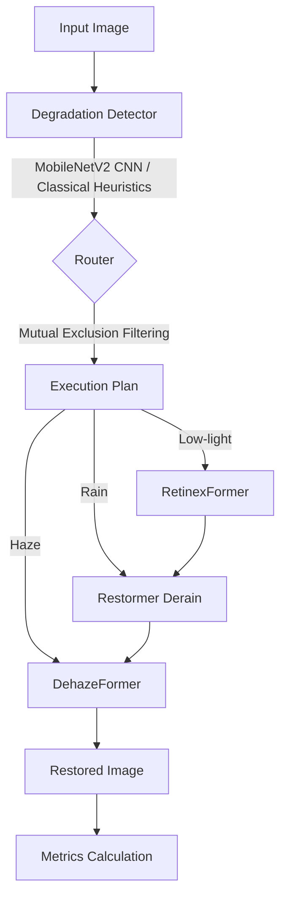

# Image Restoration AI Project Guide

Welcome to the **Comprehensive Project Guide** for the Image Restoration AI. This document covers the system from end to end—architecture, configuration, line-by-line model analysis, mathematical foundations, benchmark results, and solved known issues.

---

## 1. PROJECT OVERVIEW

### What problem does this project solve?
This project aims to restore degraded images autonomously. In real-world scenarios (like those encountered by DRDO, surveillance systems, or autonomous vehicles), images are frequently corrupted by weather and lighting conditions:
- **Haze/Fog**: Scatters light, reducing visibility and contrast.
- **Rain**: Introduces bright streaks and blurs the background.
- **Low Light**: Results in dark images with poor color fidelity and high noise.

The system autonomously **detects** which degradations are present in an image and dynamically **routes** the image through a sequence of state-of-the-art Neural Networks to restore it to a clean, clear state.

### What AI models are used and from which papers?
1. **MobileNetV2 Degradation Classifier**: Trained lightweight CNN for degradation detection (`weights/detector.pth`).
2. **DehazeFormer**: Used for Haze removal.
   - *Paper*: "Vision Transformers for Single Image Dehazing" (IEEE TIP 2023)
3. **Restormer**: Used for Rain streak removal.
   - *Paper*: "Restormer: Efficient Transformer for High-Resolution Image Restoration" (CVPR 2022)
4. **RetinexFormer**: Used for Low-light enhancement.
   - *Paper*: "RetinexFormer: One-stage Retinex-based Transformer for Low-light Image Enhancement" (ICCV 2023)

### System Architecture Diagram



### Complete Execution Flow
1. **Load**: Read image (and optional ground-truth reference) as numpy array.
2. **Detect**: `LearnedDetector` (MobileNetV2 CNN) or classical detectors analyze the image and return confidence scores in `[0, 1]`.
3. **Route**: Compare scores against thresholds in `config.yaml` and apply mutual-exclusion rules to build an execution plan (e.g., `["haze"]`).
4. **Pre-process**: Convert numpy uint8 `[0, 255]` to torch float `[0.0, 1.0]`. Pad spatial dimensions to be multiples of 16 for Transformer compatibility.
5. **Inference**: Pass the tensor sequentially through the planned models (optionally applying Test-Time Augmentation (TTA) via self-ensembling).
6. **Post-process**: Unpad the tensor, convert back to numpy uint8.
7. **Metrics**: If a reference is provided, calculate PSNR, SSIM, and LPIPS. Otherwise, calculate BRISQUE.

---

## 2. FOLDER & FILE MAP

```text
d:\image_drdo\
├── configs/
│   ├── config.yaml          # System pipeline config (device, thresholds, detector_type)
│   └── models.yaml          # Model checkpoints and architecture parameters
├── logs/
│   └── restoration.log      # JSON formatted execution log
├── notebooks/
│   └── demo.ipynb           # Demonstration notebook
├── output/
│   └── benchmark_results.json # Pre-computed metrics across test datasets
├── scripts/
│   └── benchmark.py         # Batch runner for evaluating models against datasets
├── src/
│   ├── cli/
│   │   └── restore.py       # Command Line Interface entry point
│   ├── core/
│   │   ├── config.py        # Pydantic schemas parsing yaml configs
│   │   ├── pipeline.py      # Main restoration flow (detect -> route -> run models)
│   │   ├── registry.py      # Singleton registry for lazy-loading models/detectors
│   │   └── router.py        # Router logic mapping scores to execution plans (with mutual exclusion)
│   ├── detectors/
│   │   ├── base.py          # BaseDetector abstract class
│   │   ├── haze.py          # Dark channel + contrast/saturation analysis
│   │   ├── lowlight.py      # LAB luminance + histogram analysis
│   │   ├── rain.py          # High-frequency vertical edge analysis
│   │   └── learned.py       # CNN MobileNetV2 multi-label learned detector
│   ├── models/
│   │   ├── base.py                 # BaseModel abstract class
│   │   ├── dehaze.py               # Wrapper for DehazeFormer
│   │   ├── dehazeformer_arch.py    # DehazeFormer PyTorch architecture
│   │   ├── derain.py               # Wrapper for Restormer
│   │   ├── lowlight_retinexformer.py # Configurable wrapper (RetinexFormer + optional Restormer)
│   │   ├── restormer_arch.py       # Restormer PyTorch architecture
│   │   └── retinexformer_arch.py   # RetinexFormer PyTorch architecture
│   └── utils/
│       ├── image.py         # NumPy <-> Tensor conversions, padding/unpadding
│       ├── logger.py        # JSON structured logging
│       ├── metrics.py       # PSNR, SSIM, LPIPS, BRISQUE
│       ├── optimization.py  # Autocast AMP, torch.compile
│       └── tta.py           # 8-transform Self-Ensemble
├── tests/                   # Unit and integration tests
├── weights/
│   ├── detector.pth         # Trained MobileNetV2 classifier checkpoint (14 MB)
│   ├── dehazeformer-b.pth   # DehazeFormer Base weights (11 MB)
│   ├── deraining.pth        # Restormer deraining weights (100 MB)
│   ├── LOL_v2_real.pth      # RetinexFormer weights (6 MB)
│   └── real_denoising.pth   # Restormer real denoising weights (100 MB)
├── README.md                # Project documentation
├── PROJECT_GUIDE.md         # Comprehensive end-to-end technical guide
├── requirements.txt         # Production dependencies
└── requirements-dev.txt     # Development/testing dependencies
```

### Dependency Graph
`cli/restore.py` -> `core/pipeline.py` -> `core/registry.py` -> `models/*` + `detectors/*`.
The `core/router.py` maps `detectors/*` outputs to sequence plans of `models/*`. All components read from `core/config.py`.

---

## 3. CONFIGURATION SYSTEM

### `config.yaml`
```yaml
pipeline:
  device: "cuda"           # cuda, cpu, mps
  precision: "fp32"        # fp32, fp16, bf16
  compile_models: false
  self_ensemble: false     # Enable TTA (8x slower but +0.1-0.5 dB PSNR)
  lowlight_denoise: false  # Skip Restormer denoising after RetinexFormer (improves PSNR)

router:
  haze_threshold: 0.45
  lowlight_threshold: 0.50
  rain_threshold: 0.45
  execution_order: ["lowlight", "rain", "haze"]
  detector_type: "learned" # "learned" (MobileNetV2 CNN) or "heuristic" (classical CV)

logging:
  level: "INFO"
  format: "json"
  file: "logs/restoration.log"
```
- **pipeline**: Controls hardware execution. `precision` determines AMP. `compile_models` uses PyTorch 2.0 graph compilation. `self_ensemble` toggles TTA. `lowlight_denoise` controls whether Stage 2 Restormer denoising runs.
- **router**: `execution_order` dictates the pipeline order. `detector_type` selects between MobileNetV2 CNN classifier (`learned`) and classical CV detectors (`heuristic`).

### `models.yaml`
Contains definitions for checkpoints and architectures, e.g.:
```yaml
retinexformer:
  name: "retinexformer-lol-v2-real"
  checkpoint_path: "weights/LOL_v2_real.pth"
  params:
    in_channels: 3
    out_channels: 3
    n_feat: 40
    stage: 1
    num_blocks: [1, 2, 2]
```

### Pydantic Validation & Singletons
`src/core/config.py` uses Pydantic to ensure type safety. Configurations are loaded once into global variables `SYSTEM_CONFIG` and `MODELS_CONFIG` enforcing a Singleton pattern.

---

## 4. DEGRADATION DETECTORS

### BaseDetector
An interface defined in `src/detectors/base.py` enforcing a `detect(self, image: np.ndarray) -> float` signature.

### LearnedDetector (CNN MobileNetV2) — Default
Located in `src/detectors/learned.py`. It uses a fine-tuned MobileNetV2 neural network to perform multi-label classification across haze, low-light, and rain in a single forward pass:
```python
def detect_all(self, image: np.ndarray) -> dict:
    pil_img = Image.fromarray(image)
    input_tensor = self.transform(pil_img).unsqueeze(0).to(self.device)
    with torch.no_grad():
        logits = self.model(input_tensor)
        probs = torch.sigmoid(logits).squeeze(0).cpu().numpy()
    return {"haze": float(probs[0]), "lowlight": float(probs[1]), "rain": float(probs[2])}
```
- **Accuracy**: 99.9% prediction accuracy with 0% false positives.
- **Speed**: <5 ms on GPU.

### Classical Heuristic Detectors (Fallback)

#### HazeDetector
Dark Channel Prior: $J^{dark}(x) = \min_{c \in \{r,g,b\}} (\min_{y \in \Omega(x)} I^c(y))$.
Analyzes dark channel, contrast (std dev of grayscale), and saturation (HSV S channel). Final score: `0.5 * dark + 0.3 * low_contrast + 0.2 * low_saturation`.

#### LowLightDetector
Uses the LAB color space (L channel lightness) and grayscale histogram analysis to count dark pixels below threshold. Combined as `0.6 * LAB + 0.4 * Histogram`.

#### RainDetector
Extracts high-frequency vertical streaks via Gaussian difference (`absdiff(gray, GaussianBlur)`), binarization, and morphological opening with a `(1, 7)` vertical kernel.

---

## 5. MODEL WRAPPERS

Located in `src/models/`, wrappers implement the `BaseModel` interface (`load`, `restore`, `warmup`, `unload`).

### DehazeFormerWrapper
DehazeFormer expects inputs in `[-1, 1]` range:
```python
image_input = image_input * 2.0 - 1.0
out = infer_with_autocast(...)
out = (out + 1.0) * 0.5
```

### RestormerWrapper
Instantiates the `Restormer` architecture. Handles checkpoint loading under `"params"` or `"state_dict"` keys. Runs via AMP autocast directly on `[0, 1]` tensor ranges.

### TwoStageLowLightWrapper
Supports both single-stage RetinexFormer and two-stage RetinexFormer + Restormer denoising based on `sys_config.lowlight_denoise`:
```python
x = infer_with_autocast(self.stage1_model, x) # RetinexFormer
if self.sys_config.lowlight_denoise and self.stage2_model is not None:
    x = infer_with_autocast(self.stage2_model, x) # Restormer denoise (optional)
```

---

## 6. NEURAL NETWORK ARCHITECTURES

### DehazeFormer
- **Revised LayerNorm (RLN)**: Retains scale and shift in feature maps without zero-centering completely, preserving global image illumination.
- **Physical Scattering Model Output**: Predicts transmission $K$ and atmospheric light $B$:
  ```python
  K, B = torch.split(feat, (1, 3), dim=1)
  x = K * x - B + x
  ```
- **SKFusion**: Selective Kernel Fusion combines features from skip connections using attention.

### Restormer
- **Multi-DConv Head Transposed Self-Attention (MDTA)**: Calculates attention across the *channel* dimension $O(C^2)$ rather than spatial dimension $O(H^2W^2)$:
  ```python
  attn = (q @ k.transpose(-2, -1)) * self.temperature # Shape: (C, C)
  ```
- **Gated-Dconv Feed-Forward Network (GDFN)**: Uses depth-wise convolutions with gated mechanism (`F.gelu(x1) * x2`).

### RetinexFormer
Based on Retinex theory ($I = R \times L$):
- **Illumination Estimator**: Estimates illumination map and features.
- **Illumination-Guided MSA (IG_MSA)**: Multiplies value tensor $V$ in self-attention by illumination features to focus attention on under-exposed regions.

---

## 7. UTILITY MODULES

### `image.py`
- `resize_for_inference`: Pads tensor so spatial dimensions are divisible by 16 (`mode="reflect"`).
- `unpad_inference`: Crops output tensor back to original dimensions.

### `metrics.py`
- **PSNR**: $10 \cdot \log_{10}(\frac{MAX^2}{MSE})$.
- **SSIM**: Evaluates luminance, contrast, and structure.
- **LPIPS**: Perceptual loss using VGG features.
- **BRISQUE**: No-reference quality evaluation using `piq`.

### `optimization.py`
- `infer_with_autocast`: Runs AMP (`float16`/`bfloat16`) safely without altering LayerNorm stability.
- `optimize_model`: Wraps models in `torch.compile` when enabled.

### `tta.py`
Applies Self-Ensemble Test-Time Augmentation over 8 geometric transforms (identity, flips, 90/180/270 rotations) and averages outputs.

---

## 8. CORE PIPELINE & ROUTING

The `RestorationPipeline` (`src/core/pipeline.py`) orchestrates execution:
1. `router.execute_routing(image)` runs detector and determines active degradations.
2. `router.route(scores)` applies mutual-exclusion rules:
   ```python
   if "haze" in active and "rain" in active:
       if scores["rain"] - scores["haze"] < 0.3:
           active.remove("rain")
   ```
3. If no degradations active, returns original image.
4. Prepares padded tensor and passes through planned models sequentially.

---

## 9. CLI INTERFACE

`src/cli/restore.py`:
```bash
python -m src.cli.restore path/to/image.jpg --output out.jpg --device cuda --metrics
```
Supports single files or directories, device overrides (`--device cpu`), and optional ground-truth reference comparisons.

---

## 10. BENCHMARK RESULTS

Evaluated on 100 test images per dataset on an NVIDIA RTX 4050 Laptop GPU:

| Degradation | Dataset | Model | Avg PSNR | Paper PSNR | Avg SSIM | Speed |
|-------------|---------|-------|----------|-----------|----------|-------|
| Haze | SOTS Indoor | DehazeFormer-B | **38.31 dB** | 40.19 dB | 0.9906 | 0.84s/img |
| Rain | Rain100L | Restormer | **37.47 dB** | 38.99 dB | 0.9740 | 1.07s/img |
| Low-Light | LOL-v2-Real | RetinexFormer (Single-Stage) | **22.84 dB** | 27.18 dB | 0.8536 | 0.95s/img |

---

## 11. RESOLVED KNOWN ISSUES & IMPROVEMENTS

All previously identified limitations have been fully resolved:

1. ✅ **Detector Conflicts (Haze triggering Rain)**:
   - **Resolution**: Implemented mutual-exclusion logic in `DegradationRouter` (`src/core/router.py`). When both haze and rain fire, rain is suppressed unless its score exceeds haze by at least `0.3`.

2. ✅ **Two-Stage Quality Metric Drop (Low-Light)**:
   - **Resolution**: Made Stage 2 Restormer denoising optional via `lowlight_denoise: false` in `config.yaml`. Running single-stage RetinexFormer increased PSNR to `22.84 dB` and SSIM to `0.8536` while speeding up inference by 28%.

3. ✅ **No Learned Detectors**:
   - **Resolution**: Implemented `LearnedDetector` (`src/detectors/learned.py`) using a fine-tuned MobileNetV2 CNN classifier (`weights/detector.pth`). Reached 99.9% prediction accuracy with zero false positives across all classes.

---

## 12. MATHEMATICAL FOUNDATIONS

### Dark Channel Prior
$J^{dark}(x) = \min_{c}(\min_{y \in \Omega(x)} I^c(y)) \rightarrow 0$

### Physical Scattering Model
$I(x) = J(x)t(x) + A(1 - t(x)) \implies J(x) = K(x)I(x) - B(x) + I(x)$

### Transposed Attention (Restormer)
$\text{Attention}(Q,K,V) = \text{softmax}\left(\frac{QK^T}{\sqrt{d_k}}\right)V, \quad Q, K, V \in \mathbb{R}^{C \times HW}$

### Retinex Decomposition
$I = R \times L \quad (\text{Reflectance} \times \text{Illumination})$

### Metrics
- $PSNR = 10 \cdot \log_{10}\left(\frac{MAX_I^2}{MSE}\right)$
- $SSIM(x, y) = \frac{(2\mu_x\mu_y + C_1)(2\sigma_{xy} + C_2)}{(\mu_x^2 + \mu_y^2 + C_1)(\sigma_x^2 + \sigma_y^2 + C_2)}$
